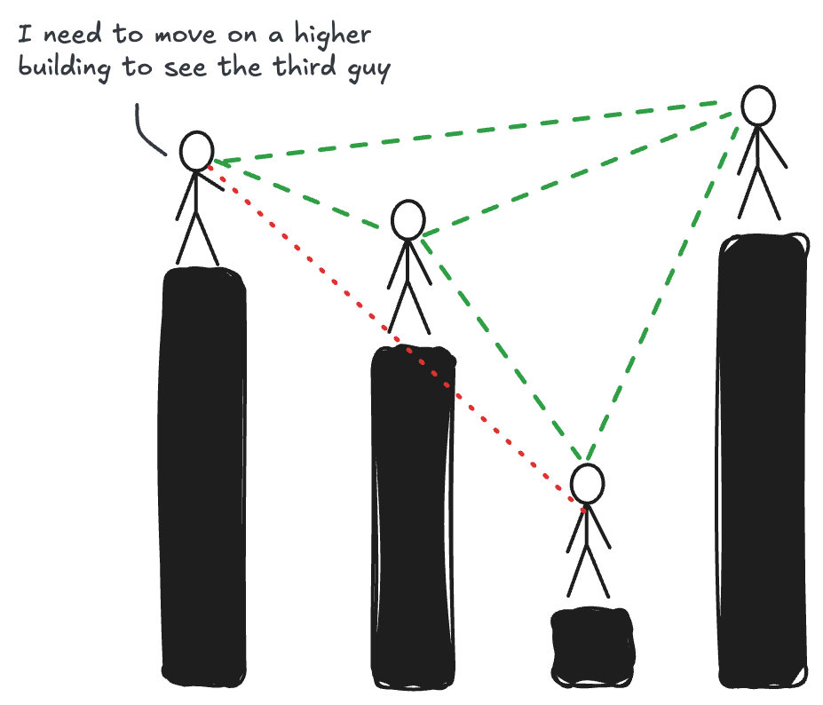

<head>
    <link rel="preload" as="image" href="visibility_xkcd_example.png">
    <link rel="preload" as="image" href="dark-visibility.png">
</head>

# 

---

<!-- Load KaTeX CSS -->
<link rel="stylesheet" href="https://cdn.jsdelivr.net/npm/katex@0.13.11/dist/katex.min.css">

<!-- Load KaTeX JavaScript -->

<!--  -->

  

I have always been a romantic, probably due to the amount and genre of songs I was exposed to in my childhood. The first song I remember is from an Italian songwriter who sings about how everything he did reminded him of a special someone. Even as a child, I could sense a hint of the emotional struggle in his lyrics, though my young heart had yet to experience the full spectrum of joy and sorrow that comes with love, which governs our heartbeats.

But this post isn't about romance or love; it's actually about heartbeats—specifically, how we can visualize and understand them using data science techniques. Let me start from the beginning. My passion for complex systems and the ways they behave has always driven me, both as a person and as a data scientist. I have always been interested in understanding how things work. During my master's, I became particularly interested in evaluating, measuring, and quantifying complex systems, extracting any relevant structure from what might initially seem like a chaotic mess.

The approach we will discuss in this blog post represents an innovative method for extracting valuable insights from complex datasets: the concept of visibility graphs. I will introduce the fundamentals of visibility graphs, explore their mathematical significance, and demonstrate an artistic way to visualize heartbeats. By leveraging the theory behind visibility graphs, we can extract meaningful insights from complex datasets, offering a unique and innovative approach to data visualization.

### Understanding Visibility Graphs through Skyscrapers

A visibility graph is a powerful tool for representing relationships between data points. To help any reader better understand how they work, let's use a more tangible metaphor: skyscrapers in a bustling city.

Picture yourself in a city filled with towering skyscrapers. Each skyscraper represents a data point. The height of each skyscraper corresponds to the magnitude of the data point it represents. This city is quite particular; in fact, all skyscrapers are arranged in a line along a single street, much like data points along a time series.

<!--  -->

  

Now, imagine you are standing on the roof of one of these skyscrapers. From your vantage point, you can see some buildings down the line, while others are obscured by taller structures in between. This scenario is a perfect analogy for understanding visibility graphs.

### The Concept of Visibility

n our metaphor, <mark>visibility</mark> means whether you can see the roof of one skyscraper from the roof of another. For two skyscrapers to see each other (i.e., to have a line of sight), there must be no other skyscraper in between that is as tall or taller. This is analogous to checking if one data point can "see" another without being obscured by an intermediate point.

This means that if skyscraper A is 50 meters tall and skyscraper B, further down the street, is 100 meters tall, you can see B from A if no other skyscraper in between is taller than 50 meters at the point it blocks the line of sight.

  <figure class="centered-figure">
    
    <figcaption>Image made using excalidraw strongly suggested by Christian te Riet, excalidraw's evangelist</figcaption>
  </figure>

However, if there's a skyscraper C that is 120 meters tall between A and B, then A cannot see B. This blockage happens because C's height interferes with the direct line of sight from A to B.

Given these instructions, we can now pass to building a network. To construct a visibility graph from this setup, we create:

- <b>Nodes</b>: Each node represents a skyscraper (or a data point in our time series). In the example below, the horizontal position of a node corresponds to the position of the skyscraper on the street, and the vertical position represents its height. For larger networks and the heartbeat example, nodes' positions will be defined based on the layout we choose, without respecting the 1-on-1 relationship with the time series like the image below.

- <b>Edges</b>: An edge between two nodes indicates a clear line of sight between the corresponding skyscrapers. If skyscraper A can see skyscraper B, an edge is drawn between the nodes representing these two skyscrapers.

<iframe src="/interactive_visibility_graph.html" width="100%" height="820" frameborder="0"></iframe>

<!-- Visualizing the Concept with Code
In the provided Python code:

Random Heights Generation: Heights for 15 skyscrapers are generated randomly, simulating the varying data points in a dataset.
Visibility Calculation: The code checks each pair of skyscrapers to determine if there's a direct line of sight between them, considering potential obstructions by other skyscrapers in between. If there is no obstruction, an edge is created in the visibility graph.
The resulting visualization consists of two main parts:

- Time Series (Bar Chart): This shows the heights of the skyscrapers over a sequence, with visibility lines overlaid to illustrate which skyscrapers can see each other.

- Visibility Graph Network (Scatter Plot): This plot displays the nodes and edges, representing the skyscrapers and their visibility relationships, respectively. The nodes are placed according to their sequence and heights, while the edges represent the lines of sight. -->

### Visibility Graphs and the maths behind

This visualization technique is particularly useful in analyzing time series data, where understanding the relationships and dependencies between different data points is crucial. For instance, in financial data analysis, a visibility graph can help identify periods where market behaviors are similar or influenced by similar factors, despite potential intervening data points.

Non-metaphorically speaking, at its core, a visibility graph is a representation of a time series or a spatial dataset where each data point is treated as a node, and an edge is created between two nodes if they have a clear line of sight. Quoting directly from the original paper [1]:

<blockquote>
given a time series ${x_i}_{(a=1)}^{N}$, a visibility graph is constructed by connecting two arbitrary data values $(t_a, y_a)$ and $(t_b, y_b)$ if they have visibility, such that if any other data $(t_c, y_c)$ placed between them fulfills $$y_c < y_b + (y_a-y_b) \frac{t_b-t_c}{t_b-t_a}$$ 
</blockquote>

We can easily check that by means of the present algorithm, the associated graph extracted from a time series is always:
1. Connected: each node sees at least its nearest neighbors (left and right).
2. Undirected: the way the algorithm is built up, there is no direction defined in the links.
3. Invariant under affine transformations of the series data: the visibility criterion is invariant under rescaling of both horizontal and vertical axes, and under horizontal and vertical translations.

This formulation ensures that two nodes are connected if no intermediate data point obscures their visibility. The resulting graph encodes the structural properties of the original dataset, revealing patterns and relationships that may not be immediately apparent.

The construction of visibility graphs relies on the visibility algorithm, which efficiently computes the edges between nodes. The algorithm has a time complexity of $O(N^2)$, where $N$ is the number of data points. However, recent advancements have led to the development of more efficient algorithms, such as the horizontal visibility graph algorithm, which reduces the time complexity to $O(N log N)$ [3].

### Visibility Graphs, why bother?

One of the key advantages of visibility graphs lies in their ability to capture both local and global properties of the dataset. Local properties, such as the degree distribution of nodes, provide insights into the immediate neighborhood of each data point. On the other hand, global properties, such as the average path length and clustering coefficient, reveal the overall structure and connectivity of the graph [4].

From a mathematical perspective, visibility graphs exhibit intriguing properties that have been extensively studied. For instance, the degree distribution of visibility graphs constructed from fractal time series follows a power law, $P(k) ~ k^(-\gamma)$, where $k$ is the degree and $\gamma$ is the scaling exponent [5]. This property has been leveraged to characterize the complexity and self-similarity of time series data.

<!-- To better understand how visibility graphs work, interact with the demonstration below. This visualization shows how a simple time series is transformed into a visibility graph, highlighting the connections between data points based on their visibility. -->

Moreover, visibility graphs have found applications in various domains, ranging from finance to neuroscience. In finance, visibility graphs have been used to analyze stock market dynamics, detect market inefficiencies, and predict future price movements [6]. By constructing visibility graphs from stock price time series, researchers have uncovered hidden patterns and correlations that traditional methods may overlook.

In neuroscience, visibility graphs have been employed to study the complex dynamics of brain activity. By transforming brain signals, such as EEG or fMRI data, into visibility graphs, researchers can characterize the functional connectivity and synchronization of different brain regions [7]. This approach has shed light on the intricate workings of the brain and has potential implications for understanding neurological disorders.

### You make my heart beat

Now we understand how visibility graphs work. I hope I didn't lose too many of you with the serious talk in the previous section, but I felt it necessary to better appreciate the results that I am about to show you. Last year, when I had some time, I used to go for a run around the neighborhood and record my run with my sport watch. Among the different parameters that you can register, the heartbeat is one of them.

  <blockquote class="styled-quote">
    

    
"The heartbeat time series becomes a graph, an object that I studied for many years of my life"

  </blockquote>
  
Since I heard about visibility graphs, I have always been interested in analyzing something unseen before and seeing what it would actually look like. The heartbeat was one of them, but during my PhD time, I didn't have a top smartwatch (nor a proper algorithm to measure heartbeat was around) to properly analyze the heartbeat like I have today. The partial result of my run is shown in the interactive graph below. 

<iframe src="/heart_rate_visibility_graph_communities.html" width="100%" height="820" frameborder="0"></iframe>

It's nothing special, except for the fact that I can actually visualize how my heartbeat's time series becomes a graph, an object that I studied for many years of my life. I find this result to be quite fascinating and artistic.

The picture shows how the graph gets populated as time increases. The different colors in the graph represent network communities, i.e., a group of nodes in a network that are more densely connected to each other than to the rest of the network.

### Conclusions

There is not much of a deep meaning to be found in this piece of analysis. It was made for the sake of introducing a nice concept like the visibility graph methodology to a wider audience and combining it with something out of the common like a heartbeat time series into something almost artistic.

As a final note, I made a small surprise playing around with the network layout. In the graph below, run the following:

1. Press the "back to orginal" button - which shows the heart beat graph layout used above;
2. Press the "Surprise!" button
3. On the top right press the little house icon and...

<iframe src="/final_network_snapshot_interactive.html" width="100%" height="450" frameborder="0"></iframe>

... my heartbeat graph was hiding a heart! 

-------

## References

[1] Lacasa, L., Luque, B., Ballesteros, F., Luque, J., & Nuno, J. C. (2008). From time series to complex networks: The visibility graph. Proceedings of the National Academy of Sciences, 105(13), 4972-4975.

[2] Luque, B., Lacasa, L., Ballesteros, F., & Luque, J. (2009). Horizontal visibility graphs: Exact results for random time series. Physical Review E, 80(4), 046103.

[3] Lan, X., Mo, H., Chen, S., Liu, Q., & Deng, Y. (2015). Fast transformation from time series to visibility graphs. Chaos: An Interdisciplinary Journal of Nonlinear Science, 25(8), 083105.

[4] Ahmadlou, M., Adeli, H., & Adeli, A. (2010). New diagnostic EEG markers of the Alzheimer's disease using visibility graph. Journal of Neural Transmission, 117(9), 1099-1109.

[5] Lacasa, L., & Toral, R. (2010). Description of stochastic and chaotic series using visibility graphs. Physical Review E, 82(3), 036120.

[6] Yang, Y., Wang, J., Yang, H., & Mang, J. (2009). Visibility graph approach to exchange rate series. Physica A: Statistical Mechanics and its Applications, 388(20), 4431-4437.

[7] Ahmadlou, M., Ahmadi, K., Rezazade, M., & Azad-Marzabadi, E. (2013). Global organization of functional brain connectivity in methamphetamine abusers. Clinical Neurophysiology, 124(6), 1122-1131.

<!-- 

  <blockquote class="styled-quote">
    

    
"The sign of social relationships is not just a detail - it's a key that unlocks hidden structural patterns in networks."

  </blockquote>
  
These findings challenge the notion that community structure alone explains assortative mixing in social networks. Instead, the nature and sign of the relationships appear to be key factors in determining network structure. The widely observed assortativity in social networks may be primarily due to positive relationships, while negative relationships exhibit different patterns. This research opens up several exciting avenues for future exploration. 

 -->

