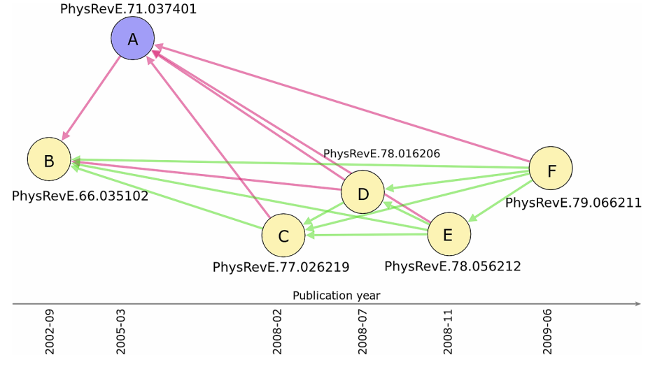

Citation networks offer a wealth of insights into the flow and evolution of knowledge in science. By tracing patterns of citations between academic papers, we can map the spread of ideas, uncover influential works, and identify emerging research fronts. However, citation networks are far from complete. Relevant papers often go uncited, obscuring important knowledge flows.

In our [paper](https://link.springer.com/content/pdf/10.1140/epjds/s13688-016-0068-2.pdf) published in EPJ Data Science, my colleagues and I set out to tackle this problem of missing citations. We proposed a new method to quantify the similarity between scientific papers based on the overlap in their reference lists. Unlike existing metrics like bibliographic coupling, our approach goes beyond raw co-citation counts. Using a statistical validation technique from network science, we assess the significance of bibliographic overlaps to identify pairs of papers that are surprisingly similar given their respective citation neighborhoods.

### The data
----
To demonstrate this method, we analyzed a vast citation network consisting of 4,672,812 articles published in American Physical Society (APS) journals over more than a century (1893-2009). For each pair of papers, we validated the similarity of their reference lists against a null model. Pairs with significantly large overlaps were deemed "missing citations" if the newer paper did not cite the older one.

### Results
---
The results revealed intriguing patterns of knowledge flow (or lack thereof) in physics. We found strong evidence of <mark>homophily: the more similar two papers are, the more likely they are to cite each other</mark>. By pinpointing unlikely gaps in these citation patterns, our method uncovered missing links between highly related papers. In one striking example, we identified several missing citations between articles on electric discharges that were published in the same journal (Physical Review E) by two different research groups, suggesting a lack of awareness of each other's work.

Aggregating missing citations also allowed us to assess and compare the efficiency of knowledge flows across subfields of physics and between journals. Interdisciplinary Physics and Electromagnetism had the lowest rates of missing citations, highlighting an effective spread of ideas. Among journals, Physical Review Letters exhibited significantly fewer missing citations than more specialized outlets like Physical Review C, pointing to the role of journal visibility in shaping citation completeness.

### Methodology
---
Our work makes several key contributions. Methodologically, we introduce a statistically principled approach to assess bibliographic similarity and identify missing links in citation networks. Empirically, our findings provide new insights into the factors that facilitate or hinder knowledge flows in science, from homophily and journal prominence to subdisciplinary boundaries. Practically, our method offers a tool to help authors, editors, and reviewers identify relevant but overlooked papers, and thus to make citation networks more complete.

This initial study lays a foundation for several avenues of future research. While we focused on over a century of physics research from APS journals, the approach can be extended to other scientific domains using larger, multi-disciplinary bibliographic databases like Web of Science or Scopus. Comparative studies could reveal how patterns of missing citations vary across fields with different epistemic cultures and citation practices.
Another intriguing direction is to use the method to provide real-time citation recommendations. Reference list similarity could be calculated between a newly submitted manuscript and the existing scientific corpus to flag relevant but uncited papers for authors and reviewers. Such a tool could be particularly valuable given the rapid growth of scientific literature in many domains.

  <blockquote class="styled-quote">
    

    
"Our findings provide new insights into the factors that facilitate or hinder knowledge flows in science, from homophily and journal prominence to subdisciplinary boundaries."

  </blockquote>
  
Finally, the general problem of identifying missing links in networks extends beyond scientific citations. The same approach could be adapted to detect important but overlooked precedents in patent citations or case law, for example. As network data proliferate, tracing and reconnecting surprising similarities offers a powerful way to map the hidden contours of knowledge flow and diffusion.
    In conclusion, our study highlights the value of network science approaches for illuminating the structure and evolution of knowledge. By revealing missing citations, we can identify barriers to effective knowledge flows and inform solutions to make scientific communication more efficient and complete.

As the volume and complexity of scientific output continue to grow, such efforts to map and improve the pathways of scientific influence will only become more vital.

