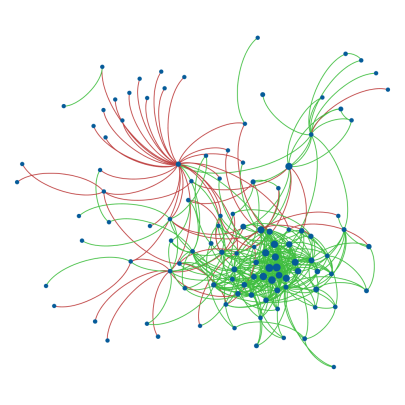

  

As a researcher in network science, I recently embarked on a fascinating journey to explore the intricate world of signed social networks. My goal was to uncover hidden patterns that emerge when we consider both positive and negative relationships in online communities.

Social networks are typically studied as purely positive structures, where connections represent friendships or collaborations. However, real-world social interactions are far more nuanced, including both positive and negative relationships. I wanted to investigate how the sign of these relationships affects the network's structural properties, particularly focusing on degree correlations - the tendency of nodes to connect with others of similar degree.

To tackle this problem, I analyzed two online social networks: Epinions, a product review site where users can trust or distrust each other, and Slashdot, a technology news site where users can mark others as friends or foes. Both networks contained hundreds of thousands of users and relationships, with a mix of positive and negative connections.

My methodology involved separating each network into positive and negative subnetworks and analyzing their degree distributions and correlations. To better understand the underlying mechanisms, I developed a class of models to simulate signed networks with various properties. These models allowed me to explore random networks with binomial degree distributions, scale-free networks with power-law degree distributions, and networks split into two or more mutually exclusive groups. By varying conditions such as structural balance, group sizes, and the assortativity of the unsigned network, I could compare the degree correlations in the simulated positive and negative subnetworks under different scenarios.

The results were intriguing. In both real-world networks, the positive subnetworks showed assortative mixing, where nodes of similar degree tend to connect. In contrast, the negative subnetworks exhibited disassortative mixing, with nodes of dissimilar degree tending to connect. Our models revealed that this pattern emerges under specific conditions: when the unsigned network is assortative or uncorrelated, the signed network is structurally balanced, and nodes are unevenly allocated into groups. Under these conditions, the positive subnetwork remains assortative, while the negative subnetwork becomes disassortative, regardless of the unsigned network's pattern.

  <blockquote class="styled-quote">
    

    
"The sign of social relationships is not just a detail - it's a key that unlocks hidden structural patterns in networks."

  </blockquote>
  
These findings challenge the notion that community structure alone explains assortative mixing in social networks. Instead, the nature and sign of the relationships appear to be key factors in determining network structure. The widely observed assortativity in social networks may be primarily due to positive relationships, while negative relationships exhibit different patterns. This research opens up several exciting avenues for future exploration. 

We could develop methods to infer the sign of links based on observed mixing patterns, investigate degree correlations across subnetworks, extend the model to account for more complex relationship types and multiplex networks, and apply these insights to better understand and predict dynamics in online communities and organizational networks.

By considering the sign of relationships, we can uncover hidden structural properties in social networks that would otherwise remain concealed. This approach promises to enhance our understanding of complex social systems and could lead to more accurate models and predictions in various domains, from online community management to organizational behavior. As we continue to explore the nuances of signed networks, we're likely to gain even deeper insights into the complex tapestry of human social interactions in the digital age.

