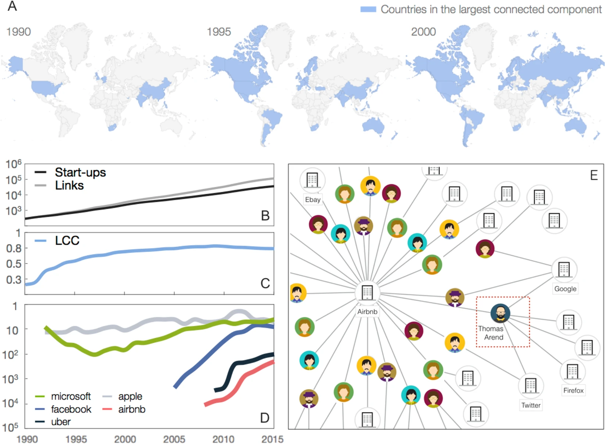

Our study explores the intricate world of start-ups by constructing and analyzing a global network of professional relationships. This network, which we call the <mark> Worldwide Startup (WWS) network </mark>, encompasses the interactions among companies, driven by the movement of individuals—such as employees, advisors, and investors—across these firms. Our primary aim is to leverage network centrality measures to predict the long-term economic success of start-ups. By focusing on how the position of a start-up within this network can influence its future, we provide a data-driven method that complements the traditional, often subjective, evaluations used by venture capitalists.

### Data Used

Our analysis is based in the dataset from Crunchbase, spanning from 1990 to 2015. This data includes detailed records of companies and the professional roles of individuals associated with them. We constructed a bipartite graph connecting people to start-ups based on these roles, which we then projected into a time-varying, one-mode network of start-ups. This network consists of 41,830 companies and 135,099 links, covering 117 countries. The network is dynamic, reflecting changes over time as companies and individuals interact and evolve.

### Methodology

Our methodological framework involves several key steps. Initially, we built the WWS network by mapping connections based on shared individuals between companies. These connections, represented as edges in our graph, do not vanish over time, signifying the persistent value of know-how and relationships. We then employed centrality measures, such as closeness centrality, to rank start-ups based on their positions within the network. 

  <blockquote class="styled-quote">
    

    
"Companies with higher centrality early on are more likely to experience positive long-term outcomes."

  </blockquote>
  

  This ranking allowed us to hypothesize that companies with higher centrality early on are more likely to experience positive long-term outcomes, such as securing funding, acquisitions, or going public.

  To validate our hypothesis, we focused on a subset of companies—those categorized as "open deals" (firms yet to receive significant financial milestones like funding rounds or IPOs). We assessed the success rate of 
  

our centrality-based recommendations by tracking these companies' outcomes over a subsequent number of year period in achieving any of the forms of success.
  
  ### Results

The analysis revealed that our network-based approach significantly outperforms random expectations. Specifically, the success rate of start-ups within the top centrality ranks was consistently higher than what would be expected by chance. For instance, in June 2003, our method identified successful companies with a 50% accuracy rate, which is substantially better than the average venture capital success rate of 10-15% for early-stage investments. Our findings suggest that centrality in the WWS network is a strong predictor of future economic performance, offering a valuable tool for investors and policy-makers.

### Future Works

Looking forward, there are several avenues for expanding this research. One critical area is exploring the impact of external factors, such as economic cycles or regional market conditions, on the predictive power of our model. Additionally, refining our centrality measures and incorporating other network features, like community structures or network dynamics over shorter time intervals, could enhance the accuracy of our predictions. Finally, extending the dataset beyond 2015 would help validate the robustness of our findings in more recent contexts, further establishing the WWS network as a reliable framework for assessing start-up potential globally.

