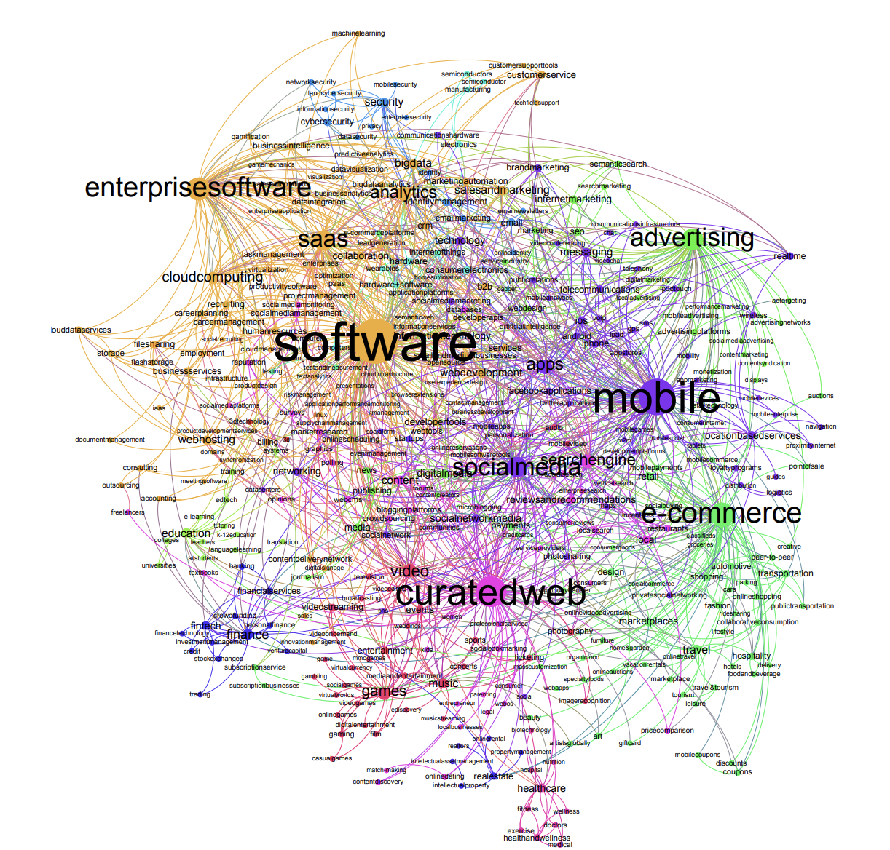

In this study, I investigate the intricate world of complex networks, focusing specifically on the effects of positive and negative connections within social and organizational networks. The research explores how these connections, along with the principle of homophily where similar individuals tend to connect and shape network structures and dynamics. The thesis is divided into several parts, each addressing different facets of network theory and its implications on social behaviors, scientific collaborations, and start-up ecosystems.

### Data Used
The data utilized in this research is rich and varied, spanning multiple domains. It includes datasets from online signed social networks, which allow for the study of both positive (friendships) and negative (hostilities) connections. Additionally, the thesis examines data from start-up ecosystems, capturing competitive and collaborative interactions among companies. Another significant dataset comes from the American Physical Society (APS) journals, used to analyze citation networks and collaboration patterns among scientists.

### Methodology
The methodologies employed are grounded in complexity science, statistics, and organizational sciences. The study uses network analysis techniques to dissect the patterns of connections—both positive and negative—among individuals and organizations. Key metrics such as degree correlations, clustering coefficients, and homophily indices are calculated to understand how similar nodes are likely to connect.

  <blockquote class="styled-quote">
    

    
"This study explores the dual roles of positive and negative connections and the impact of homophily in shaping the structure and dynamics of complex networks."

  </blockquote>
  
For example, the research investigates how competition in start-up ecosystems affects the mobility of professionals and the overall success of the ecosystem. In the case of scientific collaborations, the study introduces methods to statistically validate the likelihood of citations between articles based on their bibliographic similarities. 
  
   <b>Results:</b>
  
  The findings of this thesis are multifaceted. In the realm of social networks, it is observed that positive connections often correlate with higher degrees of interconnectedness, whereas negative connections tend to segregate nodes, creating more polarized structures.

 For start-up ecosystems, the presence of competition is shown to negatively impact the mobility of professionals and the overall dynamism of the ecosystem. The study also reveals that homophily significantly influences citation patterns in scientific literature, suggesting that similar works are more likely to reference each other. Interestingly, while homophily can foster collaboration among scientists, beyond a certain threshold, it may reduce the diversity of collaborations, limiting cross-disciplinary innovation.

### Future Works
The thesis opens up several avenues for future research. One promising direction is the further exploration of the interplay between competition and collaboration in different types of organizations and industries. Additionally, there is scope to expand the analysis of homophily and heterophily (the tendency of individuals to connect with those who are different) in broader scientific and academic contexts. Another potential area of study is the development of new models to predict the emergence of positive and negative ties in networks, particularly in the fast-evolving digital and technological landscapes.

